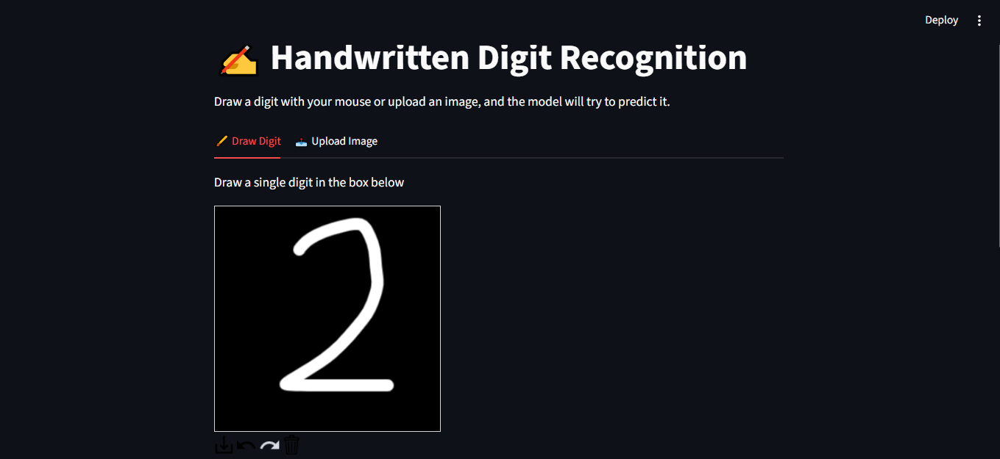
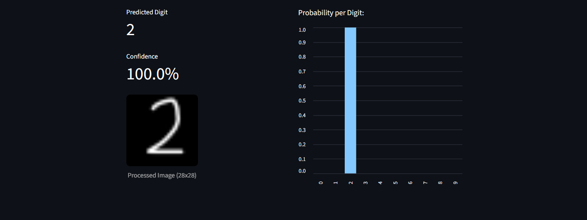
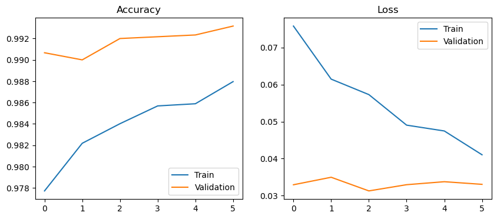

# ✍️ Handwritten Digit Recognition

A straightforward project for **CodeAlpha**Task #3, utilizing a Convolutional Neural Network (CNN) to recognize handwritten digits from 0 to 9.

[To try the app and the model directly ✍️](https://handwritten-characters-recognition.streamlit.app/)

## Project Overview

- **Model Training:** Trains a CNN architecture on the classic **MNIST dataset** (grayscale images of handwritten digits).
- **Web Interface: Built using **Streamlit**, allowing users to draw a digit directly on a canvas or upload an image file to get real-time predictions from the model.





## Repository Structure

```text
├── Handwritten_Digit_Recognition.ipynb   # Model training & analysis notebook
├── app.py                                # Streamlit web application
├── handwritten_digit_model.h5            # Saved trained model weights (generated via notebook)
├── requirements.txt                      # Project dependencies & libraries
└── README.md                             # Project documentation
```

## Neural Network Architecture

The CNN model follows a concise sequential structure:

1. **Conv2D Layer** (32 filters, 3x3 kernel, ReLU) + **BatchNormalization** + **MaxPooling2D** (2x2)
2. **Conv2D Layer** (64 filters, 3x3 kernel, ReLU) + **BatchNormalization** + **MaxPooling2D** (2x2)
3. **Dropout** (0.25) to prevent overfitting
4. **Flatten Layer**
5. **Dense Layer** (128 units, ReLU) + **Dropout** (0.5)
6. **Output Dense Layer** (10 units) with **Softmax** activation for multi-class classification (digits 0–9)

> **Training Settings:** Adam Optimizer, 10 Epochs, Batch Size = 64, integrated with `EarlyStopping` callback.



## Preprocessing Pipeline

Before feeding input images to the model, the following preprocessing steps are executed:

1. **Grayscale Conversion:** Convert single or multi-channel RGB images to single-channel grayscale.
2. **Color Inversion Check:** Ensure the background is black (`0`) and the digit is white (`255`), matching standard MNIST format.
3. **Resizing:** Scale image dimensions strictly to **28x28 pixels**.
4. **Normalization:** Normalize pixel intensity values to the `[0.0, 1.0]` floating-point range.

---

*CodeAlpha Machine Learning Internship*
