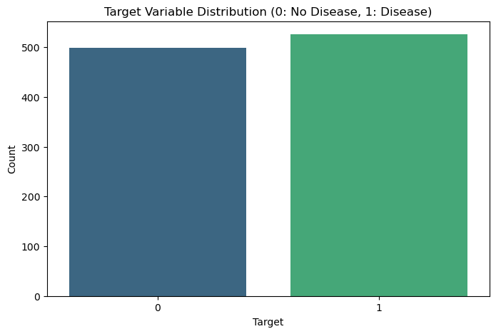
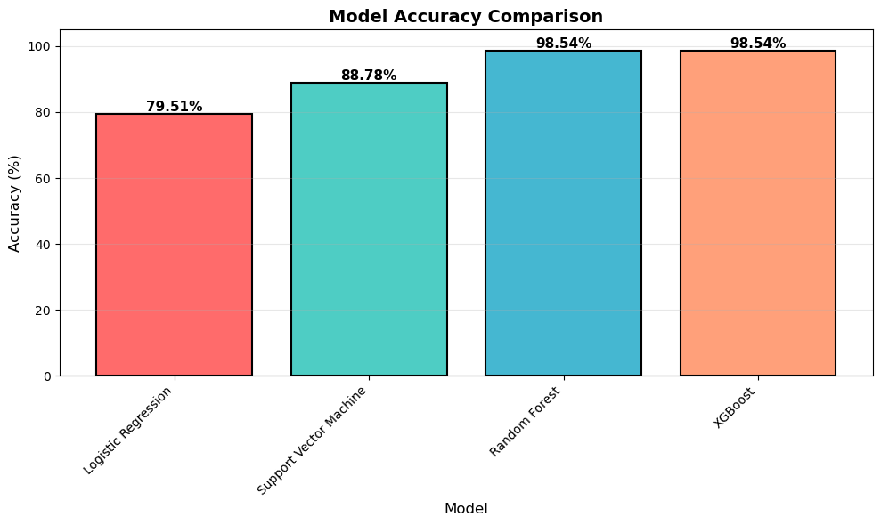
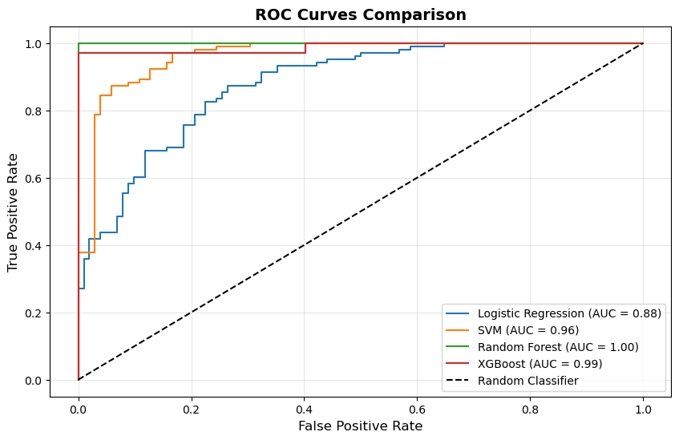

# Disease Prediction From  Medical Data

A machine learning project for predicting the presence of heart disease using medical data. The project includes data analysis, preprocessing, model training, and performance comparison between multiple ML algorithms.

## Models Used

* Logistic Regression
* Support Vector Machine (SVM)
* Random Forest Classifier
* XGBoost Classifier

## Project Workflow

* Data exploration and descriptive statistics.
* Missing value checking.
* EDA.
* Data preprocessing and feature scaling.
* Training and evaluating multiple ML models.
* Comparing models using Accuracy and ROC-AUC scores.

## Results

### Target Variable Distribution



### Accuracy Comparison



### ROC Curves Comparison


## Technologies Used

* Python
* Pandas
* NumPy
* Matplotlib
* Seaborn
* Scikit-learn
* XGBoost

## Dataset

The project uses the `heart.csv` dataset for heart disease prediction.

## Project Structure

```text
.
├── Disease_Prediction.ipynb
├── heart.csv
├── images/
│   ├── target_distribution.png
│   ├── model_accuracy.png
│   └── roc_curves.png
└── README.md
```
