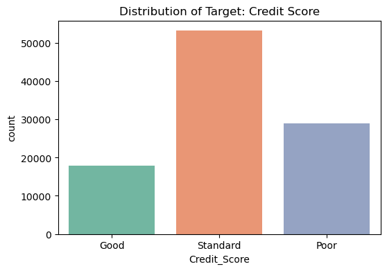
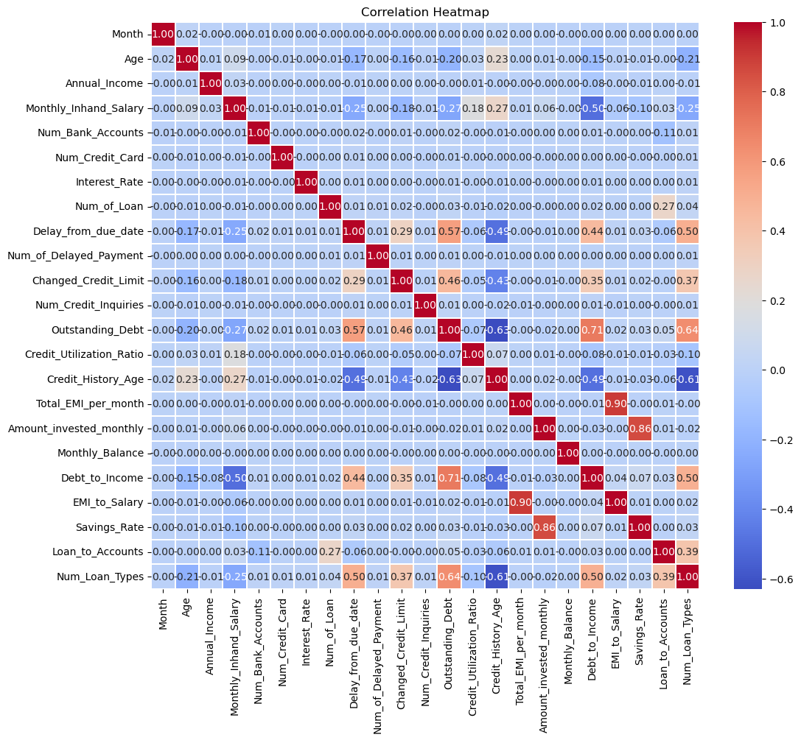
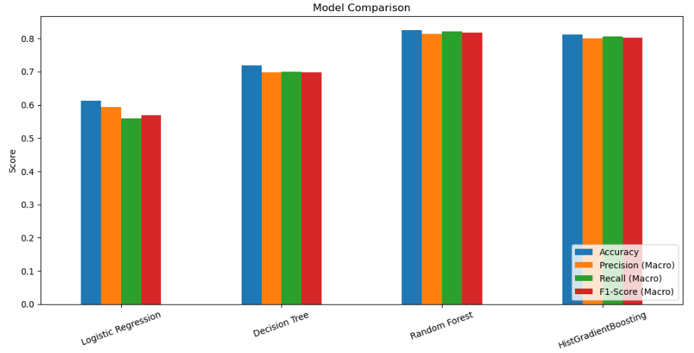
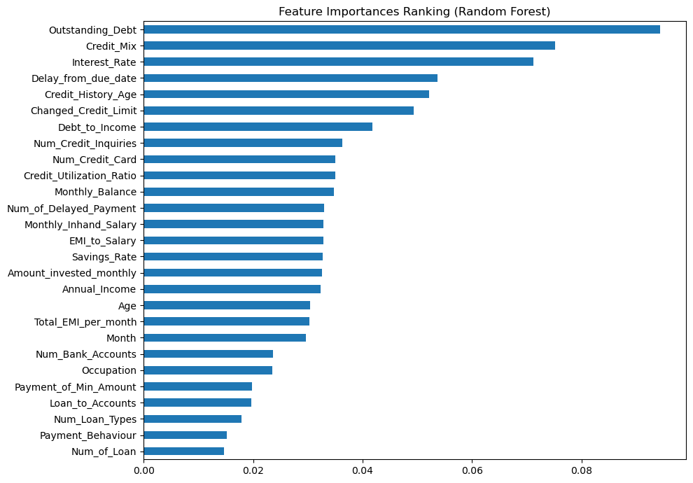

# Credit Scoring Model

A Machine Learning project developed as part of the CodeAlpha Internship Program to predict customers' credit scores based on their financial information and behavior.

## Features

* Data Cleaning and Preprocessing.
* Missing Values and Outlier Handling.
* Feature Engineering and Selection.
* Exploratory Data Analysis (EDA).
* Training and evaluating multiple classification models.
* Generating predictions for unseen data.

## Models Used

* Logistic Regression
* Decision Tree Classifier
* Random Forest Classifier
* HistGradientBoosting Classifier

## Technologies

* Python
* Pandas 
* Scikit-learn
* Matplotlib & Seaborn
* Jupyter Notebook

## Results

The final predictions are exported to:

```text
test_predictions.csv
```

### Sample Visualizations


### Target Distribution



### Correlation Heatmap



### Model Comparison



### Feature Importance



## Project Structure

```text
Credit-Scoring-Model/
│
├── Credit_Scoring_Model.ipynb
├── test_predictions.csv
├── README.md
└── images/
```

##

**Majd Tamer Eleyan**
CodeAlpha Internship .
